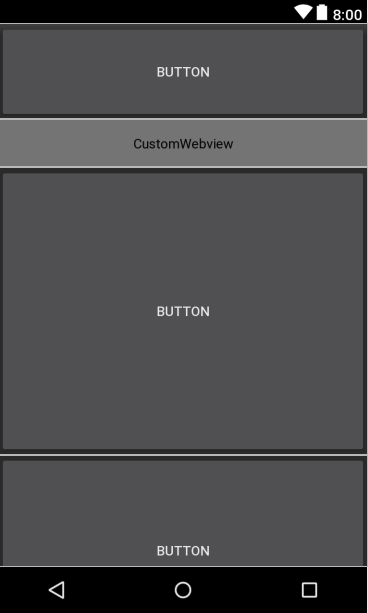
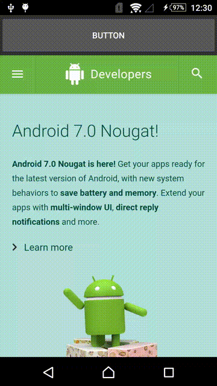
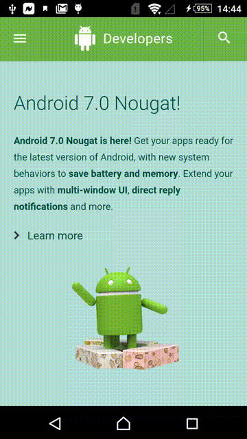

# NestedScrollView and NestedWebView with seamless fling control

This sample code is composed of NestedScrollView and WebView. The height of WebView is screen height but the content of WebView could be scrolled. 

The problem is how to control two scroll bar in drag/fling mode? For drag issue, Android provides NestedScrollingChildHelper to reach the feature. But how to fling between NestedScrollView and WebView? 

In this sample, webview would pass the fling velocity to parent scroll view and parent handles all of fling position.

# Layout
The height of CustomWebview is screen height.

# Without NestedScrollView
This looks like normal scrollview. User cannot scroll content of webview.

# With NestedScrollView

